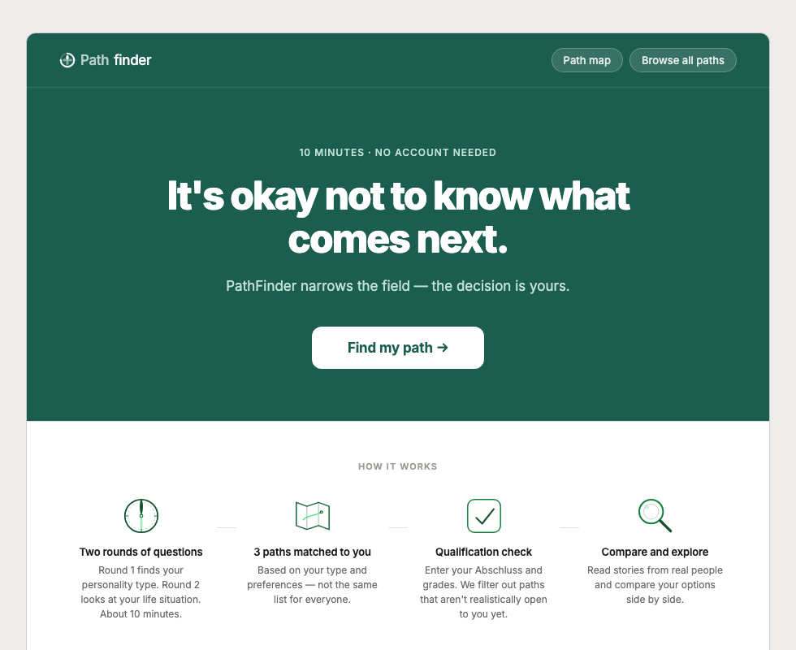
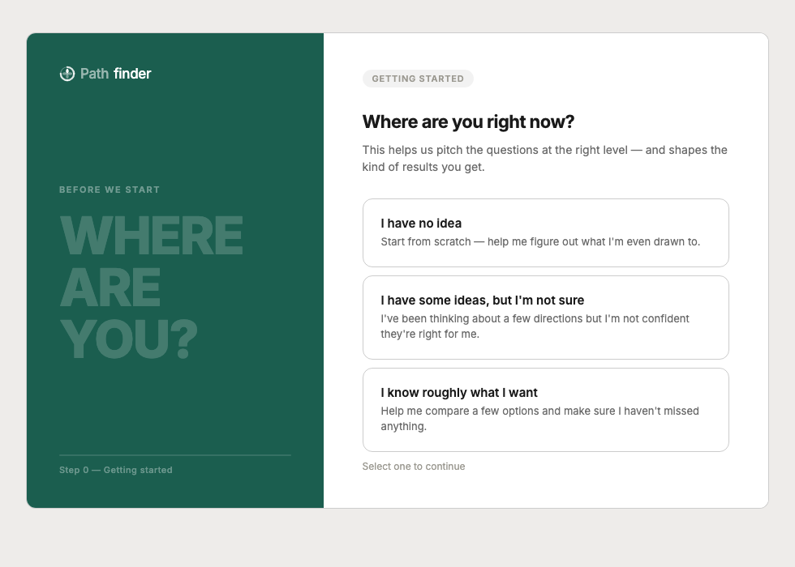
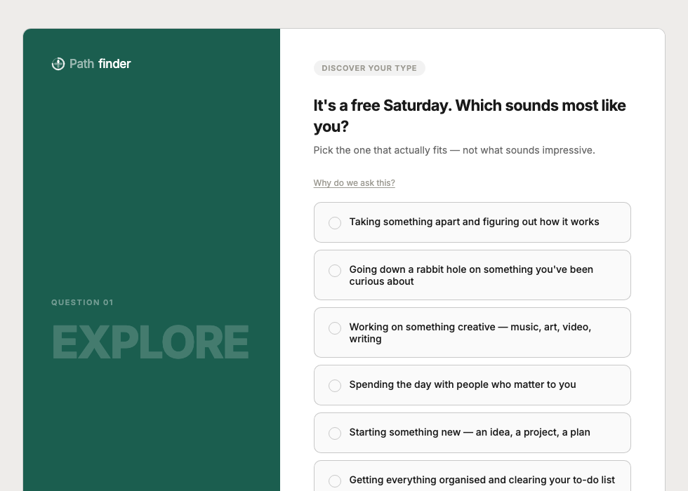
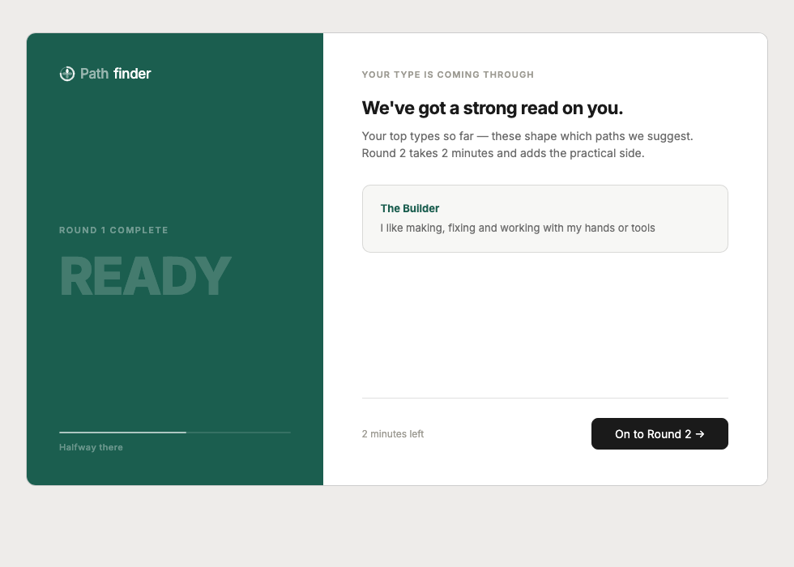
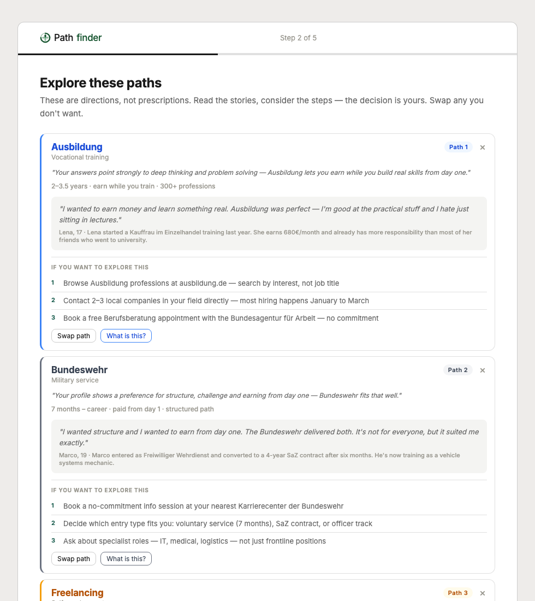
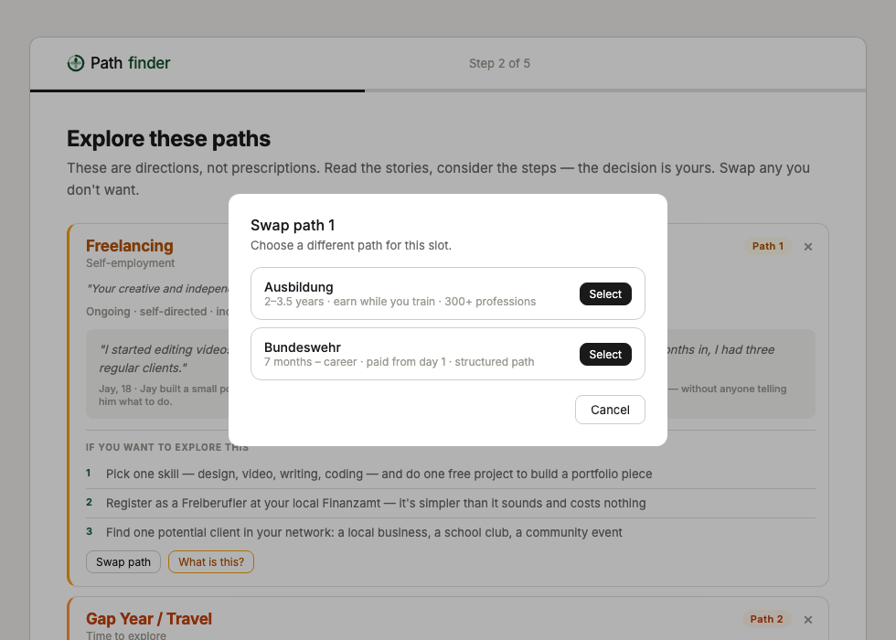

# PathFinder — Prototype State Handoff
_Updated 2026-05-07. For use as a briefing document for a fresh assistant._

---

## 1. Project Structure

```
pathfinder/
├── index.html
├── main.js                  ← app entry, state machine, routing
├── chat.js                  ← floating AI chat assistant (Claude Haiku)
├── styles.css
├── data/
│   ├── questions.js         ← ROUND1_QUESTIONS, ROUND2_QUESTIONS, RIASEC_MODES
│   ├── paths.js             ← ALL_PATHS, CERT_RANK, CLUSTER_LABELS
│   ├── colors.js            ← pathColor() helper
│   ├── path-details.js      ← extended copy for detail modal
│   └── stories.js           ← story data for stories screen
├── logic/
│   └── matching.js          ← scoring, anchors, wildcards, filtering
├── screens/
│   ├── welcome.js           ← landing page
│   ├── opener.js            ← "Where are you now?" (lena/malik/clear modes)
│   ├── quiz.js              ← renderQuiz + renderRound2Intro
│   ├── savickas.js          ← narrative prompts (role model, story, motto)
│   ├── blocks.js            ← "What's getting in the way?" chip screen
│   ├── success-picture.js   ← "Good Tuesday" miracle question
│   ├── paths.js             ← results cards + wildcards + swap
│   ├── qualifications.js    ← cert/grades input
│   ├── field-narrowing.js   ← cluster interest picker
│   ├── comparison.js        ← side-by-side table
│   ├── stories.js           ← real-person story cards
│   ├── browse.js            ← browse-all paths
│   ├── map.js               ← full path map
│   └── path-detail-modal.js ← modal with extended path info
└── docs/
    ├── PROTOTYPE_STATE.md   ← this file
    └── screenshots/
        ├── 01-welcome.png
        ├── 02-opener.png
        ├── 03-quiz-q1.png
        ├── 04-quiz-late.png   ← Round 2 intro (adaptive stop triggered)
        ├── 05-results.png
        └── 06-swap-modal.png
```

---

## 2. Tech Stack

| | |
|---|---|
| **Language** | Vanilla JS (ES modules, no build step) |
| **Framework** | None — plain DOM manipulation |
| **CSS** | Single `styles.css`, CSS custom properties, Inter via Google Fonts |
| **Build tool** | None |
| **Dev server** | `python3 -m http.server 8080` from project root |
| **package.json** | Does not exist — zero dependencies |
| **AI chat** | Claude Haiku (`claude-haiku-4-5-20251001`) via direct browser fetch; API key stored in `localStorage` as `pf_api_key` |
| **Browser target** | Modern evergreen (uses `hidden` attribute, `?.` optional chaining) |

---

## 3. User Flow

| Screen | Key | What it does | State read | State written |
|---|---|---|---|---|
| Welcome | `WELCOME` | Hero + "How it works" — entry point | — | — |
| Opener | `OPENER` | "Where are you right now?" — 3 modes | — | `userMode` |
| Quiz R1 | `QUIZ_R1` | 6–10 RIASEC questions, adaptive | `round1Index`, `round1Answers` | `round1Answers`, `round1Index` |
| Round 2 Intro | `ROUND2_INTRO` | Shows top 2 RIASEC types, bridges to R2 | `round1Answers` | — |
| Savickas | `SAVICKAS` | Optional: role model / story / motto | `savickasAnswers` | `savickasAnswers` |
| Quiz R2 | `QUIZ_R2` | 5 questions: anchor + lifestyle | `round2Index`, `round2Answers` | `round2Answers`, `round2Index` |
| Blocks | `BLOCKS` | "What's getting in the way?" — chips | `blocks`, `blocksOther` | `blocks`, `blocksOther` |
| Success Picture | `SUCCESS_PICTURE` | "Good Tuesday" free text; triggers `computeResults()` | `successPicture` | `successPicture`, all computed state |
| Paths | `PATHS` | 3 results + 0–2 wildcards; story, next steps, swap | `suggestedPaths`, `wildcardPaths`, `reasons` | (swap mutates `suggestedPaths`, recalcs `wildcardPaths`) |
| Qualifications | `QUALIFICATIONS` | Abschluss + grades input | `quals`, `filterResult` | `quals`, `filterResult` |
| Field Narrowing | `FIELD_NARROWING` | Interest cluster picker | `selectedClusters` | `selectedClusters` |
| Comparison | `COMPARISON` | Side-by-side attribute table | `suggestedPaths` | — |
| Stories | `STORIES` | Real-person story cards | `suggestedPaths` | — |
| Browse | `BROWSE` | All 6 paths browsable (from Welcome) | — | — |
| Map | `MAP` | Visual overview of all paths (from Welcome) | — | — |

**Chat assistant** (`chat.js`) is mounted once after `render()` in `main.js` and persists across all screen navigations via `document.body.appendChild`. It reads current state dynamically on each send via a `getChatContext()` closure.

---

## 4. Screens Built

| File | Description | Status |
|---|---|---|
| `screens/welcome.js` | Hero + 4-step "How it works" with SVG icons | ✅ Full |
| `screens/opener.js` | Split-panel mode selector (lena/malik/clear) | ✅ Full |
| `screens/quiz.js` | Split-panel quiz with inspire word, progress bar, "Why we ask" toggle | ✅ Full |
| `screens/savickas.js` | 3 optional narrative textareas (role model, story, motto) | ✅ Full |
| `screens/blocks.js` | 5 chip options + free-text "other" for blocking beliefs | ✅ Full |
| `screens/success-picture.js` | "Good Tuesday" miracle question textarea | ✅ Full |
| `screens/paths.js` | 3 results + 0–2 wildcards, human story, action plan, dismiss ×, swap modal | ✅ Full |
| `screens/qualifications.js` | Certificate picker, grade buttons, extras | ✅ Full |
| `screens/field-narrowing.js` | 6 cluster interest cards (2-col grid) | ✅ Full |
| `screens/comparison.js` | Attribute table comparing selected paths | ✅ Full |
| `screens/stories.js` | Story cards with quotes | 🟡 Partial (story data stubbed) |
| `screens/browse.js` | All-paths grid with filters | ✅ Full |
| `screens/map.js` | Path landscape map view | 🟡 Partial (static layout) |
| `screens/path-detail-modal.js` | Full path detail overlay | ✅ Full |
| `chat.js` | Floating chat button + slide-in drawer; Claude Haiku; API key bar; typing indicator | ✅ Full |

---

## 4b. Current Code State — Key Exports Per File

### `main.js`
- `SCREENS` — const object of all screen keys
- `FRESH_STATE()` — factory returning the full initial state object
- `navigate(screen)` — sets `state.screen`, calls `render()`, scrolls to top
- `computeResults()` — runs after SUCCESS_PICTURE; populates `riasecCounts`, `unsureCount`, `userMode` (may override to lena), `lifestyle`, `suggestedPaths`, `reasons`, `filterResult`, `wildcardPaths`
- `getChatContext()` — formats current state into a plain-text string for the chat system prompt
- `render()` — big switch on `state.screen`; mounts the right screen into `#app`

### `chat.js`
- `initChat(getContext)` — called once from `main.js` after first `render()`; appends `.chat-fab` button and `.chat-drawer` panel to `document.body`; they persist across all navigations
- API key stored in `localStorage` as `pf_api_key`; shown in a key bar inside the drawer until saved
- `callClaude(getContext, onChunk, onError)` — internal; fetches `https://api.anthropic.com/v1/messages` with header `anthropic-dangerous-direct-browser-access: true`; uses `claude-haiku-4-5-20251001`; max 400 tokens; includes `getContext()` output appended to the system prompt

### `logic/matching.js`
| Export | What it does |
|---|---|
| `countTypes(selectedIds)` | Tallies RIASEC types from option IDs; excludes `'unsure'` type |
| `shouldEndRound1(answers)` | Returns true if top-2 types are identical across last 3 answers |
| `computeRiasec(round1Answers)` | Aggregates all R1 answers into `{ R, I, A, S, E, C }` counts |
| `countUnsure(round1Answers)` | Counts options ending in `_u`; triggers lena-mode at ≥3 |
| `extractLifestyle(round2Answers)` | Returns `{ anchor, wantsIncomeNow, studyOpen, prefersStructure, prefersFlexibility, riskAverse, explorer }` |
| `scorePaths(riasecCounts, anchor)` | Ranks all 6 paths by RIASEC score + anchor boost (blended, single pass) |
| `suggestPaths(riasecCounts, lifestyle)` | Calls `scorePaths`, applies income/study/explorer post-sort nudges, returns top 3 |
| `getWildcards(riasecCounts, suggestedPaths, anchor, count)` | Returns `count` next-ranked paths not in suggestedPaths |
| `buildReasons(paths, riasecCounts, lifestyle)` | Returns `{ [path.id]: string }` — sentences naming top RIASEC type + anchor phrase when present |
| `filterByQuals(paths, quals)` | Returns `{ [path.id]: { open: bool, note: string\|null } }` |

### `data/questions.js`
- `RIASEC_MODES` — `{ R, I, A, S, E, C }` each with `{ emoji, name, desc }` (teen-friendly labels: Builder, Thinker, Creator, etc.)
- `ROUND1_QUESTIONS` — array of 10 questions (see section 5)
- `ROUND2_QUESTIONS` — array of 5 questions (see section 5)

### `data/paths.js`
- `ALL_PATHS` — array of 6 path objects (ausbildung, studium, fsj, freelancing, bundeswehr, gap-year)
- `CERT_RANK` — `{ Hauptschulabschluss: 1, Realschulabschluss: 2, Fachhochschulreife: 3, Abitur: 4 }` for qualification filtering
- `CLUSTER_LABELS` — display names for field-narrowing clusters

### `data/colors.js`
- `pathColor(pathId)` — returns `{ border, bg, text }` CSS colour strings for each path; used on result cards and detail modal

### `data/path-details.js`
- `PATH_DETAILS` — object keyed by path ID; extended copy for the detail modal (longer description, pros/cons, FAQs). **Not updated** to include `human_story`/`nextSteps` — those live on `ALL_PATHS` in `paths.js`.

### `data/stories.js`
- `STORIES` — array of story objects used by `screens/stories.js`. **Placeholder content** — minimal real data.

### `screens/opener.js`
- `renderOpener({ onSelect })` — split-panel screen; 3 clickable tiles for lena/malik/clear; calls `onSelect(mode)` after 240ms visual feedback

### `screens/savickas.js`
- `renderSavickas({ answers, onContinue, onBack })` — split-panel; 3 optional textareas (role model, story, motto); Skip passes empty strings, Continue passes filled values

### `screens/blocks.js`
- `renderBlocks({ selected, otherText, onContinue, onBack })` — 5 toggle chips + conditional free-text textarea for 'other'; Skip passes `([], '')`

### `screens/success-picture.js`
- `renderSuccessPicture({ text, onContinue, onBack })` — single textarea with "good Tuesday" framing; Skip passes `''`

### `screens/paths.js`
- `renderPaths({ suggestedPaths, wildcardPaths, reasons, userMode, unsureCount, successPicture, blocks, blocksOther, savickasAnswers, onConfirm, onSwap })` — renders mode-aware heading, up to 4 acknowledgement banners, 3 main path cards + 0–2 wildcard cards (amber badge), swap modal, dismiss ×

### `screens/quiz.js`
- `renderQuiz({ round, questionIndex, selections, onAnswer, onNext, onBack, onBrowse })` — shared for both R1 and R2; split-panel with inspire word, option list, "Why we ask" collapsible, progress bar
- `renderRound2Intro({ dominantTypes, onContinue })` — bridge screen showing top-2 RIASEC type cards before Savickas

---

## 5. Quiz Content

### Round 1 — RIASEC Discovery (6–10 questions, adaptive)

Each question has: `id`, `word` (shown large on left panel), `text`, `hint`, `why` (collapsible toggle), `multi: false`, `options[]` where each option has `{ id, text, type }`. All R1 options include a final `unsure` option (type `'unsure'`).

**Adaptive stopping rule:** After question 3, if the same top-2 RIASEC types appear in the last 3 consecutive answers, Round 1 ends early. `unsure` answers are excluded from convergence detection. Hard ceiling: 10 questions.

#### All 10 Round 1 Questions

| # | `word` | Question text | RIASEC options (R · I · A · S · E · C) |
|---|---|---|---|
| Q1 | EXPLORE | It's a free Saturday. Which sounds most like you? | taking apart · rabbit hole · creative · people · start something · organise |
| Q2 | LEAD | Your class is doing a group project. Which role do you naturally end up in? | building the thing · research · design · keeping group together · taking charge · making the plan |
| Q3 | SOLVE | Which kind of problem do you actually find satisfying to solve? | physical/fixing · puzzling/patterns · expressive · human/helping · strategic · messy/order |
| Q4 | FOCUS | Which of these would you most happily spend a whole afternoon on? | hands-on workshop · hard maths problem · art/design project · discussion · business idea · building a system |
| Q5 | SUPPORT | A friend asks for help. You're at your best when… | fixing something practical · researching options · helping them express · listening · making a plan · organising |
| Q6 | IMAGINE | When you imagine a good day five years from now, it looks like… | working with hands · thinking/researching · creating · being around people · running something · knowing exactly what to do |
| Q7 | ACT | Your group project hits a problem. You step in to… | fix the technical issue · figure out what went wrong · rethink the approach · reconnect the group · take over · reorganise the plan |
| Q8 | FLOW | You feel most "in the zone" when you're… | hands-on/physical · deep research · making something creative · good conversation · moving fast on your own thing · getting through a list |
| Q9 | REFLECT | Which of these sounds most like you? | good with hands · ask lots of questions · see things differently · people come to me · always have ideas · reliable/do things properly |
| Q10 | BELONG | At school, which situation felt most natural? | practical lesson/lab · hard problem clicking · creative assignment · group work · presenting/leading · clear rules/executing |

All `unsure` options follow the pattern `{ id: 'r1qN_u', type: 'unsure' }` and are counted separately — excluded from RIASEC scoring and early-stop detection.

#### Full source — ROUND1_QUESTIONS (complete)

```js
export const ROUND1_QUESTIONS = [
  {
    id: 'r1q1', word: 'EXPLORE',
    text: "It's a free Saturday. Which sounds most like you?",
    hint: 'Pick the one that actually fits — not what sounds impressive.',
    why: 'How you spend free time reveals what you genuinely value — without any pressure to perform.',
    multi: false,
    options: [
      { id: 'r1q1_r', text: 'Taking something apart and figuring out how it works', type: 'R' },
      { id: 'r1q1_i', text: 'Going down a rabbit hole on something you\'ve been curious about', type: 'I' },
      { id: 'r1q1_a', text: 'Working on something creative — music, art, video, writing', type: 'A' },
      { id: 'r1q1_s', text: 'Spending the day with people who matter to you', type: 'S' },
      { id: 'r1q1_e', text: 'Starting something new — an idea, a project, a plan', type: 'E' },
      { id: 'r1q1_c', text: 'Getting everything organised and clearing your to-do list', type: 'C' },
      { id: 'r1q1_u', text: 'Honestly, it depends — none of these really fit', type: 'unsure' },
    ],
  },
  {
    id: 'r1q2', word: 'LEAD',
    text: 'Your class is doing a group project. Which role do you naturally end up in?',
    hint: 'Think about what actually happens — not what you wish you did.',
    why: 'How you naturally show up in a group tells us more about your working style than any subject.',
    multi: false,
    options: [
      { id: 'r1q2_r', text: 'Building or making the actual thing', type: 'R' },
      { id: 'r1q2_i', text: 'Doing the research and making sure everything\'s accurate', type: 'I' },
      { id: 'r1q2_a', text: 'Handling the design, visuals or how it\'s presented', type: 'A' },
      { id: 'r1q2_s', text: 'Keeping the group together when things get tense', type: 'S' },
      { id: 'r1q2_e', text: 'Taking charge and making sure the thing actually gets done', type: 'E' },
      { id: 'r1q2_c', text: 'Making the plan, dividing tasks and tracking progress', type: 'C' },
      { id: 'r1q2_u', text: 'I hang back — it depends a lot on who else is in the group', type: 'unsure' },
    ],
  },
  {
    id: 'r1q3', word: 'SOLVE',
    text: 'Which kind of problem do you actually find satisfying to solve?',
    hint: 'The one that makes you lose track of time.',
    why: 'The problems that pull you in point to your interests more honestly than any grade or subject choice.',
    multi: false,
    options: [
      { id: 'r1q3_r', text: 'Something physical — fixing, building, making it work', type: 'R' },
      { id: 'r1q3_i', text: 'Something puzzling — understanding why, finding the pattern', type: 'I' },
      { id: 'r1q3_a', text: 'Something expressive — finding the right way to say or show something', type: 'A' },
      { id: 'r1q3_s', text: 'Something human — helping someone figure out a situation', type: 'S' },
      { id: 'r1q3_e', text: 'Something strategic — figuring out the best way to get a result', type: 'E' },
      { id: 'r1q3_c', text: 'Something messy — bringing order to chaos or organising information', type: 'C' },
      { id: 'r1q3_u', text: 'I don\'t think I have a type — I just deal with whatever comes up', type: 'unsure' },
    ],
  },
  {
    id: 'r1q4', word: 'FOCUS',
    text: 'Which of these would you most happily spend a whole afternoon on?',
    hint: 'Go with your gut.',
    why: 'What holds your attention for hours is usually a reliable clue to where you\'d thrive long-term.',
    multi: false,
    options: [
      { id: 'r1q4_r', text: 'A hands-on workshop — tools, electronics, building something', type: 'R' },
      { id: 'r1q4_i', text: 'A hard science or maths problem that takes real effort to crack', type: 'I' },
      { id: 'r1q4_a', text: 'An art, music, media or design project', type: 'A' },
      { id: 'r1q4_s', text: 'A discussion about something that really matters to people', type: 'S' },
      { id: 'r1q4_e', text: 'Coming up with a business idea or plan for something', type: 'E' },
      { id: 'r1q4_c', text: 'Building a system or spreadsheet that finally makes sense of something', type: 'C' },
      { id: 'r1q4_u', text: 'None of these — I\'d probably just watch something or see friends', type: 'unsure' },
    ],
  },
  {
    id: 'r1q5', word: 'SUPPORT',
    text: 'A friend asks for your help with something big. You\'re at your best when...',
    hint: 'What do people actually come to you for?',
    why: 'What people genuinely ask you for help with is often your quiet strength — even if you don\'t think of it as a skill.',
    multi: false,
    options: [
      { id: 'r1q5_r', text: 'Helping fix or build something practical', type: 'R' },
      { id: 'r1q5_i', text: 'Researching the options and figuring out what makes sense', type: 'I' },
      { id: 'r1q5_a', text: 'Helping them express something they can\'t find the words for', type: 'A' },
      { id: 'r1q5_s', text: 'Just listening and thinking it through together', type: 'S' },
      { id: 'r1q5_e', text: 'Making a plan and helping them take action', type: 'E' },
      { id: 'r1q5_c', text: 'Organising all the moving parts so nothing falls through the cracks', type: 'C' },
      { id: 'r1q5_u', text: 'Honestly, people don\'t really come to me for this kind of thing', type: 'unsure' },
    ],
  },
  {
    id: 'r1q6', word: 'IMAGINE',
    text: 'When you imagine a good day five years from now, it looks like...',
    hint: 'Not what sounds good — what actually appeals to you.',
    why: 'Imagining your future environment — not just your job title — tells us a lot about where you\'d feel at home.',
    multi: false,
    options: [
      { id: 'r1q6_r', text: 'Working with your hands or tools on something real', type: 'R' },
      { id: 'r1q6_i', text: 'Spending most of the day thinking, researching or solving', type: 'I' },
      { id: 'r1q6_a', text: 'Creating something that didn\'t exist before', type: 'A' },
      { id: 'r1q6_s', text: 'Being around people and making a difference in someone\'s day', type: 'S' },
      { id: 'r1q6_e', text: 'Running something — your own thing or a team', type: 'E' },
      { id: 'r1q6_c', text: 'Knowing exactly what needs to be done and doing it really well', type: 'C' },
      { id: 'r1q6_u', text: 'I genuinely have no idea — five years feels too far to picture', type: 'unsure' },
    ],
  },
  {
    id: 'r1q7', word: 'ACT',
    text: 'Your group project hits a problem. You step in to...',
    hint: 'What you\'d actually do, not what you think you should do.',
    why: 'How you respond under pressure reveals instincts that are hard to fake — and hard to teach.',
    multi: false,
    options: [
      { id: 'r1q7_r', text: 'Fix the technical issue nobody else can solve', type: 'R' },
      { id: 'r1q7_i', text: 'Figure out what went wrong and why', type: 'I' },
      { id: 'r1q7_a', text: 'Rethink the approach and come up with something better', type: 'A' },
      { id: 'r1q7_s', text: 'Get everyone talking again and reconnect the group', type: 'S' },
      { id: 'r1q7_e', text: 'Take over and make sure it gets back on track', type: 'E' },
      { id: 'r1q7_c', text: 'Reorganise the plan and make sure everyone knows what to do', type: 'C' },
      { id: 'r1q7_u', text: 'Step back — I don\'t like taking over unless I have to', type: 'unsure' },
    ],
  },
  {
    id: 'r1q8', word: 'FLOW',
    text: 'You feel most "in the zone" when you\'re...',
    hint: 'That feeling where time disappears.',
    why: 'Flow states happen when your skills and challenge are perfectly matched — that\'s the sweet spot career researchers say to build a path around.',
    multi: false,
    options: [
      { id: 'r1q8_r', text: 'Doing something physical or hands-on', type: 'R' },
      { id: 'r1q8_i', text: 'Deep in research or working through a complex idea', type: 'I' },
      { id: 'r1q8_a', text: 'Making something creative from scratch', type: 'A' },
      { id: 'r1q8_s', text: 'In a really good conversation or helping someone through something', type: 'S' },
      { id: 'r1q8_e', text: 'Moving fast on something you\'re driving yourself', type: 'E' },
      { id: 'r1q8_c', text: 'Getting through a list with real focus and efficiency', type: 'C' },
      { id: 'r1q8_u', text: 'I\'m not sure I get that feeling very often', type: 'unsure' },
    ],
  },
  {
    id: 'r1q9', word: 'REFLECT',
    text: 'Which of these sounds most like you?',
    hint: 'No right answer — pick the one that fits best.',
    why: 'Direct self-description is one of the most honest ways to identify a personality type — and you\'re the expert on yourself.',
    multi: false,
    options: [
      { id: 'r1q9_r', text: 'I\'m good with my hands and like seeing how things actually work', type: 'R' },
      { id: 'r1q9_i', text: 'I ask a lot of questions and really like to understand things deeply', type: 'I' },
      { id: 'r1q9_a', text: 'I see things differently and have a strong sense of style or expression', type: 'A' },
      { id: 'r1q9_s', text: 'People come to me when they need someone to talk to', type: 'S' },
      { id: 'r1q9_e', text: 'I always have ideas and I like to make things happen', type: 'E' },
      { id: 'r1q9_c', text: 'I\'m reliable and I like things to be done properly', type: 'C' },
      { id: 'r1q9_u', text: 'None of these — I\'m still figuring out who I am', type: 'unsure' },
    ],
  },
  {
    id: 'r1q10', word: 'BELONG',
    text: 'At school, which situation felt most natural to you?',
    hint: 'Think back to when something actually clicked.',
    why: 'School memories of "clicking" often reveal your learning style and the kind of environment where you do your best work.',
    multi: false,
    options: [
      { id: 'r1q10_r', text: 'A practical lesson — lab work, workshop, building something', type: 'R' },
      { id: 'r1q10_i', text: 'Working through a hard problem until it finally made sense', type: 'I' },
      { id: 'r1q10_a', text: 'A creative assignment you could make your own', type: 'A' },
      { id: 'r1q10_s', text: 'Group work where you connected with your team', type: 'S' },
      { id: 'r1q10_e', text: 'Presenting something or taking the lead on a project', type: 'E' },
      { id: 'r1q10_c', text: 'An assignment with clear rules where you could execute really well', type: 'C' },
      { id: 'r1q10_u', text: 'Nothing at school really clicked for me', type: 'unsure' },
    ],
  },
];
```

### Round 2 — Values + Life Stage (always 5 questions)

No adaptive logic — all 5 always shown. Q0 captures the Schein career anchor.

```js
export const ROUND2_QUESTIONS = [
  {
    id: 'r2q0', word: 'VALUES',
    text: 'Which of these matters most to you in what comes next?',
    hint: 'Pick the one that feels truest — not what sounds impressive.',
    why: 'These six options map to career anchors — the things people consistently refuse to give up.',
    multi: false,
    options: [
      { id: 'r2q0_tech',    text: 'Being really good at something specific — a craft, a skill, an expertise', type: 'anchor_tech' },
      { id: 'r2q0_auto',    text: 'Working on my own terms — freedom and independence above all', type: 'anchor_auto' },
      { id: 'r2q0_secure',  text: 'A stable, reliable path — I want to know what I\'m getting into', type: 'anchor_secure' },
      { id: 'r2q0_impact',  text: 'Doing something that genuinely helps people or makes a difference', type: 'anchor_impact' },
      { id: 'r2q0_create',  text: 'Building or creating something of my own', type: 'anchor_create' },
      { id: 'r2q0_balance', text: 'A life where work fits around the rest — not the other way around', type: 'anchor_balance' },
    ],
  },
  {
    id: 'r2q1', word: 'MONEY',
    text: 'How important is it that you earn money straight after school?',
    hint: 'Be honest — this shapes everything.',
    why: 'Whether you need income now is a practical constraint that directly shapes which paths are realistic.',
    multi: false,
    options: [
      { id: 'r2q1_high', text: 'Very — I need to start earning as soon as possible', type: 'income_high' },
      { id: 'r2q1_mid',  text: 'Somewhat — money matters, but I\'d wait for the right path', type: 'income_mid' },
      { id: 'r2q1_low',  text: 'Not much — I\'d invest time first if it pays off later', type: 'income_low' },
    ],
  },
  {
    id: 'r2q2', word: 'RHYTHM',
    text: 'What kind of daily life sounds more appealing to you?',
    hint: 'Think about the day-to-day, not the end goal.',
    why: 'Some paths give you full structure (Bundeswehr, Ausbildung), others are self-directed (freelancing, gap year).',
    multi: false,
    options: [
      { id: 'r2q2_structured', text: 'A clear structure — I know what I\'m doing and when', type: 'structure_high' },
      { id: 'r2q2_mixed',      text: 'A mix — some structure but room to adapt', type: 'structure_mid' },
      { id: 'r2q2_flexible',   text: 'Full flexibility — I set my own schedule', type: 'structure_low' },
    ],
  },
  {
    id: 'r2q3', word: 'LEARN',
    text: 'How do you feel about studying more after school?',
    hint: 'No judgement either way.',
    why: 'Some paths require years of study; others let you learn entirely on the job.',
    multi: false,
    options: [
      { id: 'r2q3_done', text: 'Done — I want to learn by doing, not sit in class', type: 'study_no' },
      { id: 'r2q3_open', text: 'Open to it — if it leads somewhere specific and practical', type: 'study_maybe' },
      { id: 'r2q3_yes',  text: 'I\'d actually like it — I want to go deep in a subject I care about', type: 'study_yes' },
    ],
  },
  {
    id: 'r2q4', word: 'DECIDE',
    text: 'When it comes to your next step, what feels more like you?',
    hint: 'Think about what would actually make you feel okay right now.',
    why: 'Some people need a clear, secure plan; others find too much certainty stifling. Neither is wrong.',
    multi: false,
    options: [
      { id: 'r2q4_secure',  text: 'I want a clear, secure path — I know what I\'m aiming for', type: 'risk_low' },
      { id: 'r2q4_middle',  text: 'Some uncertainty is fine if the upside is worth it', type: 'risk_mid' },
      { id: 'r2q4_explore', text: 'I\'d rather explore first and figure it out as I go', type: 'risk_high' },
    ],
  },
];
```

---

## 6. Matching Logic

Full current source of `logic/matching.js`:

```js
import { ALL_PATHS, CERT_RANK } from '../data/paths.js';
import { ROUND1_QUESTIONS } from '../data/questions.js';

const OPTION_TYPE_MAP = {};
ROUND1_QUESTIONS.forEach(q => {
  q.options.forEach(opt => { OPTION_TYPE_MAP[opt.id] = opt.type; });
});

// 'unsure' type answers are excluded from all RIASEC counts
export function countTypes(selectedIds) {
  const counts = {};
  selectedIds.forEach(id => {
    const type = OPTION_TYPE_MAP[id];
    if (type && type !== 'unsure') counts[type] = (counts[type] || 0) + 1;
  });
  return counts;
}

export function shouldEndRound1(round1Answers) {
  if (round1Answers.length < 3) return false;
  const last3 = round1Answers.slice(-3);
  const top2PerQuestion = last3.map(answers => {
    const counts = countTypes(answers);
    return Object.entries(counts)
      .sort((a, b) => b[1] - a[1])
      .slice(0, 2).map(e => e[0]).sort().join(',');
  });
  if (!top2PerQuestion[0]) return false;
  return top2PerQuestion[0] === top2PerQuestion[1] &&
         top2PerQuestion[1] === top2PerQuestion[2];
}

export function computeRiasec(round1Answers) {
  const allIds = Object.values(round1Answers).flat();
  return countTypes(allIds);
}

// Count how many R1 questions got an 'unsure' answer
export function countUnsure(round1Answers) {
  return Object.values(round1Answers).flat().filter(id => id.endsWith('_u')).length;
}

export function extractLifestyle(round2Answers) {
  const allIds = Object.values(round2Answers).flat();
  const anchorId = allIds.find(id => id.startsWith('r2q0_'));
  return {
    anchor: anchorId ? anchorId.replace('r2q0_', '') : null,
    wantsIncomeNow: allIds.includes('r2q1_high'),
    studyOpen: allIds.includes('r2q3_yes') || allIds.includes('r2q3_open'),
    prefersStructure: allIds.includes('r2q2_structured'),
    prefersFlexibility: allIds.includes('r2q2_flexible'),
    riskAverse: allIds.includes('r2q4_secure'),
    explorer: allIds.includes('r2q4_explore'),
  };
}

const ANCHOR_BOOSTS = {
  tech:    { ausbildung: 2, studium: 1, bundeswehr: 1 },
  auto:    { freelancing: 3, 'gap-year': 2 },
  secure:  { ausbildung: 2, bundeswehr: 3 },
  impact:  { fsj: 3, studium: 1 },
  create:  { freelancing: 3, studium: 1, 'gap-year': 1 },
  balance: { fsj: 2, 'gap-year': 2, freelancing: 1 },
};

export function scorePaths(riasecCounts, anchor) {
  const pathBoost = anchor ? (ANCHOR_BOOSTS[anchor] || {}) : {};
  return ALL_PATHS.map(path => {
    let score = 0;
    for (const type of path.riasecFit) score += riasecCounts[type] || 0;
    score += pathBoost[path.id] || 0;
    return { path, score };
  }).sort((a, b) => b.score - a.score).map(x => x.path);
}

export function suggestPaths(riasecCounts, lifestyle) {
  const ranked = scorePaths(riasecCounts, lifestyle?.anchor);
  if (lifestyle?.wantsIncomeNow) {
    const incomeBoost = { high: 2, variable: 1, low: 0 };
    ranked.sort((a, b) => (incomeBoost[b.incomeFit] || 0) - (incomeBoost[a.incomeFit] || 0));
  }
  if (lifestyle?.studyOpen === false)
    ranked.sort((a, b) => (a.id === 'studium' ? 1 : 0) - (b.id === 'studium' ? 1 : 0));
  if (lifestyle?.explorer) {
    const gapIdx = ranked.findIndex(p => p.id === 'gap-year');
    if (gapIdx > 2) { const [gap] = ranked.splice(gapIdx, 1); ranked.splice(2, 0, gap); }
  }
  return ranked.slice(0, 3);
}

// Returns up to `count` wildcard paths (next-ranked paths not in top 3)
export function getWildcards(riasecCounts, suggestedPaths, anchor, count = 1) {
  const ranked = scorePaths(riasecCounts, anchor);
  const suggestedIds = new Set(suggestedPaths.map(p => p.id));
  const wildcards = [];
  for (const p of ranked) {
    if (!suggestedIds.has(p.id)) {
      wildcards.push(p);
      if (wildcards.length >= count) break;
    }
  }
  return wildcards;
}

const ANCHOR_PHRASES = {
  tech:    'being really good at something specific',
  auto:    'working on your own terms',
  secure:  'having a stable, reliable path',
  impact:  'making a genuine difference',
  create:  'building something of your own',
  balance: 'a life where work fits around the rest',
};

// Reason sentence names both top RIASEC type and anchor (when present)
export function buildReasons(paths, riasecCounts, lifestyle) {
  const anchor = lifestyle?.anchor || null;
  const anchorPhrase = anchor ? ANCHOR_PHRASES[anchor] : null;

  const meaningfulCounts = Object.fromEntries(
    Object.entries(riasecCounts).filter(([k]) => k !== 'unsure')
  );
  const topType = Object.entries(meaningfulCounts).sort((a, b) => b[1] - a[1])[0]?.[0];
  const modeLabels = {
    R: 'hands-on and practical work',
    I: 'deep thinking and problem solving',
    A: 'creative expression',
    S: 'helping and connecting with people',
    E: 'leading and making things happen',
    C: 'structure and doing things properly',
  };
  const topLabel = modeLabels[topType] || 'your answers';

  function reason(id) {
    const a = anchorPhrase;
    const r = {
      ausbildung: a
        ? `You scored high on ${topLabel} and care about ${a} — Ausbildung delivers both from day one.`
        : `Your answers point strongly to ${topLabel} — Ausbildung lets you earn while you build real skills from day one.`,
      studium: a
        ? `You scored high on ${topLabel} and value ${a} — studying gives you the depth and flexibility to go far.`
        : `You scored high on ${topLabel} — studying gives you the depth and time to go far in a field you care about.`,
      fsj: a
        ? `You gravitate towards people and helping, and ${a} matters to you — a voluntary year gives you real experience without a long commitment.`
        : `You gravitate towards people and helping — a voluntary year gives you real experience before committing to a longer path.`,
      freelancing: a
        ? `Your creative and independent streak came through clearly, and ${a} is central to you — freelancing is built around exactly that.`
        : `Your creative and independent streak came through clearly — freelancing lets you build on your own terms.`,
      bundeswehr: a
        ? `Your profile shows challenge-seeking and ${a} — the Bundeswehr is one of the few paths that delivers both from day one.`
        : `Your profile shows a preference for structure, challenge and earning from day one — Bundeswehr fits that well.`,
      'gap-year': a
        ? `Your answers suggest exploration over immediate commitment, and ${a} fits that — a gap year gives you time and experience before deciding.`
        : `Your answers suggest you value exploration over immediate commitment — a gap year gives you time and experience before deciding.`,
    };
    return r[id] || `Based on your ${topLabel} profile${a ? ` and ${a}` : ''}.`;
  }

  const out = {};
  for (const path of paths) out[path.id] = reason(path.id);
  return out;
}

export function filterByQuals(paths, quals) {
  const userCertRank = CERT_RANK[quals.cert] ?? 0;
  const out = {};
  for (const path of paths) {
    const open = userCertRank >= (CERT_RANK[path.minCert] ?? 0);
    let note = null;
    if (!open) note = `Typically requires ${path.minCert} — exceptions exist with strong work experience.`;
    else if (path.id === 'freelancing' && !quals.hasPortfolio)
      note = 'Open — building a client base takes time without a portfolio yet.';
    else if (path.id === 'studium' && quals.cert === 'Realschulabschluss')
      note = 'Open — you\'d need Fachhochschulreife or Abitur first, or via second-chance routes.';
    out[path.id] = { open, note };
  }
  return out;
}
```

---

## 7. Data Model

Shape of a path object (`data/paths.js`):

```ts
{
  id: string,           // 'ausbildung' | 'studium' | 'fsj' | 'freelancing' | 'bundeswehr' | 'gap-year'
  name: string,
  tagline: string,
  meta: string,         // displayed as subtitle (duration · income · key fact)
  description: string,
  riasecFit: string[],  // RIASEC type codes, order matters for scoring
  incomeFit: 'high' | 'variable' | 'low',
  typical_day: string,
  income_now: string,
  freedom: string,
  flexibility: string,
  outlook: string,
  minCert: string | null,    // Hauptschulabschluss / Realschulabschluss / Fachhochschulreife / Abitur
  clusters: string[],        // for field-narrowing screen
  stories: string[],         // story IDs (for stories screen)
  nextSteps: string[],       // 3 concrete action steps shown on result card
  human_story: {
    name: string,            // "Lena, 17"
    quote: string,
    detail: string,
  },
  branches?: Array<{         // only on 'studium'
    id: string, name: string, desc: string, meta: string
  }>,
}
```

Two example entries (abbreviated):

```js
{
  id: 'ausbildung',
  name: 'Ausbildung', tagline: 'Vocational training',
  meta: '2–3.5 years · earn while you train · 300+ professions',
  riasecFit: ['R', 'C', 'E'], incomeFit: 'high', minCert: 'Hauptschulabschluss',
  nextSteps: [
    'Browse Ausbildung professions at ausbildung.de — search by interest, not job title',
    'Contact 2–3 local companies in your field directly — most hiring happens January to March',
    'Book a free Berufsberatung appointment with the Bundesagentur für Arbeit — no commitment',
  ],
  human_story: {
    name: 'Lena, 17',
    quote: 'I wanted to earn money and learn something real. Ausbildung was perfect…',
    detail: 'Lena started a Kauffrau im Einzelhandel training last year. She earns 680€/month…',
  },
},
{
  id: 'freelancing',
  name: 'Freelancing', tagline: 'Self-employment',
  meta: 'Ongoing · self-directed · income varies',
  riasecFit: ['A', 'E', 'I'], incomeFit: 'variable', minCert: null,
  nextSteps: [
    'Pick one skill — design, video, writing, coding — and do one free project to build a portfolio piece',
    'Register as a Freiberufler at your local Finanzamt — it\'s simpler than it sounds and costs nothing',
    'Find one potential client in your network: a local business, a school club, a community event',
  ],
  human_story: {
    name: 'Jay, 18',
    quote: 'I started editing videos for local businesses while everyone else was applying for Ausbildung.',
    detail: 'Jay built a small portfolio editing social media content. Six months in, he had three regular clients.',
  },
},
```

---

## 8. State Model

Defined as `FRESH_STATE()` in `main.js`. Full current shape:

```js
{
  screen: 'welcome',             // current SCREENS key
  userMode: null,                // 'lena' | 'malik' | 'clear' — set by opener; can be
                                 // overridden to 'lena' by unsureCount ≥3 in computeResults()
  round1Answers: {},             // { [questionIndex]: [optionId, ...] }
  round2Answers: {},             // { [questionIndex]: [optionId, ...] }
  round1Index: 0,                // current R1 question pointer
  round2Index: 0,                // current R2 question pointer
  round1Length: 0,               // how many R1 Qs were actually asked
  unsureCount: 0,                // count of R1 questions where user chose the 'unsure' option
                                 // computed in computeResults(); ≥3 auto-routes to lena mode
  savickasAnswers: {             // from screens/savickas.js (all optional)
    roleModel: '',
    story: '',
    motto: '',
  },
  blocks: [],                    // string[] — selected block chip IDs from screens/blocks.js
  blocksOther: '',               // free text when 'other' chip is selected
  successPicture: '',            // "good Tuesday" free text from screens/success-picture.js
  riasecCounts: {},              // { R: n, I: n, A: n, S: n, E: n, C: n }
  lifestyle: {},                 // { anchor, wantsIncomeNow, studyOpen, prefersStructure,
                                 //   prefersFlexibility, riskAverse, explorer }
  suggestedPaths: [],            // Array<Path> — top 3 from suggestPaths()
  wildcardPaths: [],             // Array<Path> — length 0, 1, or 2 depending on userMode:
                                 //   lena=2, malik/clear=0, null=1
  reasons: {},                   // { [path.id]: string } — "why this path" sentences
  quals: {
    cert: null,                  // Hauptschulabschluss | Realschulabschluss | ... | null
    overallGrade: null,
    overallPoints: null,
    langs: ['German'],
    engLevel: null,
    experience: null,
    experienceOther: null,
    extras: [],
    hasPortfolio: false,
  },
  filterResult: {},              // { [path.id]: { open: bool, note: string|null } }
  selectedClusters: [],          // string[] — from field-narrowing screen
}
```

**`computeResults()` in `main.js`** — called once when the user continues from SUCCESS_PICTURE:
```js
function computeResults() {
  state.riasecCounts = computeRiasec(state.round1Answers);
  state.unsureCount  = countUnsure(state.round1Answers);
  if (state.unsureCount >= 3 && state.userMode !== 'lena') state.userMode = 'lena';
  state.lifestyle      = extractLifestyle(state.round2Answers);
  state.suggestedPaths = suggestPaths(state.riasecCounts, state.lifestyle);
  state.reasons        = buildReasons(state.suggestedPaths, state.riasecCounts, state.lifestyle);
  state.filterResult   = filterByQuals(state.suggestedPaths, state.quals);
  const wildcardCount  = state.userMode === 'lena' ? 2 : (state.userMode === null ? 1 : 0);
  state.wildcardPaths  = getWildcards(state.riasecCounts, state.suggestedPaths, state.lifestyle?.anchor, wildcardCount);
}
```

---

## 9. Brief-Compliance Checklist

_Updated 2026-05-07. Each of the six brief gaps is audited below with the relevant code snippet._

---

### 1. Does userMode change the quiz flow, copy, or results framing?

**🟡 Partial — framing and wildcard count change; quiz questions do not.**

Mode-aware subheadings in `screens/paths.js`:
```js
const SUBHEADINGS = {
  lena:  'Three broad directions to start exploring. Read the stories — there\'s no need to pick anything today.',
  malik: 'Three options — read the stories and see which one resonates. Swap any you don\'t want.',
  clear: 'Sense-checking what you already think. These are directions, not verdicts — the decision is still yours.',
  null:  'These are directions, not prescriptions. Read the stories, consider the steps — the decision is yours.',
};
```

Wildcard count varies by mode in `main.js computeResults()`:
```js
const wildcardCount = state.userMode === 'lena' ? 2 : (state.userMode === null ? 1 : 0);
state.wildcardPaths = getWildcards(state.riasecCounts, state.suggestedPaths, state.lifestyle?.anchor, wildcardCount);
```

**What doesn't change:** The quiz questions, their order, and the round structure are identical for all three modes. `userMode` is not consulted anywhere in `screens/quiz.js`.

---

### 2. Is unsure-count tracked and does ≥3 auto-route to Lena-mode?

**✅ Done — fully implemented.**

Counter in `logic/matching.js`:
```js
export function countUnsure(round1Answers) {
  return Object.values(round1Answers).flat().filter(id => id.endsWith('_u')).length;
}
```

Auto-routing in `main.js computeResults()`:
```js
state.unsureCount  = countUnsure(state.round1Answers);
if (state.unsureCount >= 3 && state.userMode !== 'lena') state.userMode = 'lena';
```

Shown as an acknowledgement banner on the results screen:
```js
if (unsureCount >= 3) {
  ackHTML += `<div class="results-ack">
    You weren't sure on ${unsureCount} questions — that's completely normal.
    Here are some broader directions to start with rather than forcing a decision.
  </div>`;
}
```

---

### 3. Does the "this fits because…" sentence name both the RIASEC type and the anchor?

**✅ Done — both are named when an anchor is selected.**

`buildReasons(paths, riasecCounts, lifestyle)` in `logic/matching.js`:
```js
const ANCHOR_PHRASES = {
  tech:    'being really good at something specific',
  auto:    'working on your own terms',
  secure:  'having a stable, reliable path',
  impact:  'making a genuine difference',
  create:  'building something of your own',
  balance: 'a life where work fits around the rest',
};

// topLabel = RIASEC label (e.g. "deep thinking and problem solving")
// a        = anchor phrase (e.g. "working on your own terms"), null if skipped

ausbildung: a
  ? `You scored high on ${topLabel} and care about ${a} — Ausbildung delivers both from day one.`
  : `Your answers point strongly to ${topLabel} — Ausbildung lets you earn while you build real skills from day one.`,
```

If the user skips R2Q0, the sentence falls back to RIASEC only — the anchor phrase is injected only when present.

---

### 4. Are the Savickas prompts (role model, story, motto) implemented anywhere?

**🟡 Partial — collected and acknowledged on results; do not influence path scoring.**

`screens/savickas.js` presents all three prompts as optional textareas between ROUND2_INTRO and QUIZ_R2. Values are stored in `state.savickasAnswers` and shown as an acknowledgement on the results screen:
```js
if (savickasAnswers && (savickasAnswers.roleModel || savickasAnswers.motto || savickasAnswers.story)) {
  const ref = savickasAnswers.motto
    ? `Your motto — "${savickasAnswers.motto}" — shaped how we framed things here.`
    : savickasAnswers.roleModel
      ? `You admire ${savickasAnswers.roleModel} — we've kept that in mind.`
      : `You keep coming back to ${savickasAnswers.story} — worth thinking about why.`;
  ackHTML += `<div class="results-ack" style="font-style:italic;">${ref}</div>`;
}
```

**What's missing:** The narrative content is not parsed or used to boost any path score. `logic/matching.js` has no reference to `savickasAnswers`.

---

### 5. Is there a "what does success look like?" screen before results?

**🟡 Partial — screen exists and is in the flow; content is acknowledged but doesn't affect scoring.**

`screens/success-picture.js` presents the miracle question with "good Tuesday" framing. It sits at `BLOCKS → SUCCESS_PICTURE → PATHS` and triggers `computeResults()` on continue. The text is shown back as a quote card on the results screen:
```js
if (successPicture) {
  const preview = successPicture.length > 120 ? successPicture.slice(0, 117) + '…' : successPicture;
  ackHTML += `<div class="results-ack results-ack-quote">
    <span>You said</span>
    "${preview}"
  </div>`;
}
```

**What's missing:** The free text is never parsed or used to reweight paths in `logic/matching.js`.

---

### 6. Is there a "what's holding you back?" prompt implemented?

**🟡 Partial — screen exists and is in the flow; selection is acknowledged but doesn't affect scoring.**

`screens/blocks.js` presents five chips plus a free-text "other" field between QUIZ_R2 and SUCCESS_PICTURE:
```js
const BLOCK_OPTIONS = [
  { id: 'money',        label: 'Money pressure' },
  { id: 'family',       label: 'What family or friends will think' },
  { id: 'wrong-choice', label: 'Fear of choosing wrong' },
  { id: 'behind',       label: 'Feeling behind everyone else' },
  { id: 'other',        label: 'Something else' },
];
```

Selected blocks are stored in `state.blocks` and acknowledged on the results screen with a static reassurance message. **What's missing:** Blocks have no effect on which paths are suggested or how they're framed.

---

### Summary table

| Requirement | Status |
|---|---|
| Opener screen with userMode routing | ✅ Done |
| Persistent "I'm not sure" option on every R1 question | ✅ Done |
| Unsure-count tracked; ≥3 auto-routes to Lena-mode | ✅ Done |
| Round 2 Schein anchor question (R2Q0) | ✅ Done |
| Anchor named in "this fits because…" sentence | ✅ Done |
| Results subheading varies by userMode | ✅ Done |
| Wildcard count varies by userMode (lena=2, malik/clear=0) | ✅ Done |
| Savickas prompts (role model, story, motto) collected | ✅ Done |
| Savickas answers influence path matching | ❌ Missing |
| "Good Tuesday" success-picture screen | ✅ Done |
| Success-picture text influences path matching | ❌ Missing |
| "What's getting in the way?" blocks screen | ✅ Done |
| Blocks selection influences path matching | ❌ Missing |
| Quiz flow adapts per userMode (different Qs/order) | ❌ Missing |
| "Why we ask" toggle on every question | ✅ Done |
| Each result card dismissable (×) | ✅ Done |
| Progress indicator during quiz | ✅ Done |
| RIASEC + anchor both named in reason sentence | ✅ Done |
| Floating AI chat assistant (always accessible) | ✅ Done |

---

## 10. Known Gaps / TODOs

**Qualitative inputs are collected but not connected to scoring:**
`state.savickasAnswers` (role model, story, motto), `state.successPicture`, and `state.blocks` are all captured and shown back as acknowledgement text. None of them feed into `logic/matching.js`. Connecting them would require either keyword parsing or a separate scoring layer that re-ranks paths based on the narrative content.

**Quiz flow is mode-blind:**
All three `userMode` values (`lena`/`malik`/`clear`) go through exactly the same question sequence. The brief implies the "I have no idea" mode should get a more exploratory framing or a different set of questions. Only the results screen subheading and wildcard count currently change.

**Anchor and RIASEC are blended, not sequential:**
The brief describes RIASEC as a filter and anchor as a re-ranker within that filtered set. Current implementation adds anchor as a numeric boost to the RIASEC score before sorting — both dimensions are collapsed into one pass. This rarely produces wrong results but diverges from the described two-layer model.

**Wildcard list not refreshed in component after swap:**
`state.wildcardPaths` is recalculated in `main.js` on swap (via `onSwap`), but `renderPathCards` inside `screens/paths.js` closes over the original `wildcardPaths` prop. A swap replaces a main path correctly but the wildcard section on screen doesn't reflect the updated exclusion set until a full re-render.

**Data gaps:**
- `data/stories.js` has placeholder content; the stories screen renders but story text is sparse.
- `data/path-details.js` (used by the modal) hasn't been updated to match the `human_story`/`nextSteps` fields now on `ALL_PATHS`.

**UI edge case:**
The Round 2 intro (`renderRound2Intro`) shows the top 2 RIASEC types. If the user answered "I'm not sure" on every R1 question, `riasecCounts` is empty and the intro renders with no type cards.

---

## Screenshots

| | |
|---|---|
|  |  |
| **01 — Welcome screen** | **02 — Opener: "Where are you right now?"** |
|  |  |
| **03 — Quiz Q1 (EXPLORE / split panel + "Why we ask" link)** | **04 — Round 2 intro (adaptive stop after 4 R-type answers)** |
|  |  |
| **05 — Results: story, action plan, dismiss ×** | **06 — Swap modal overlay** |
